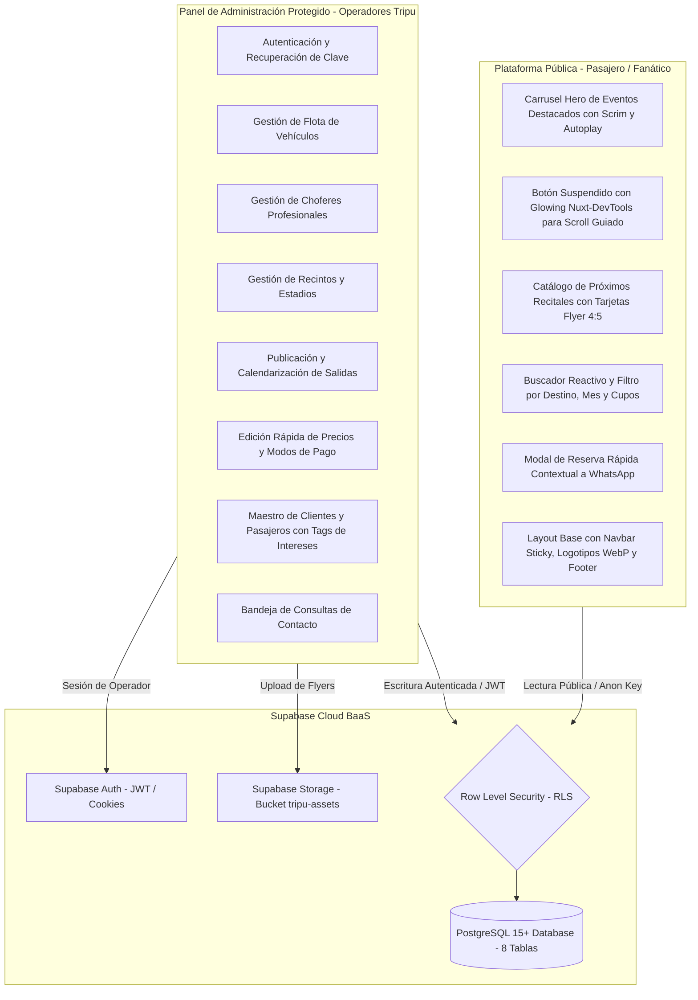
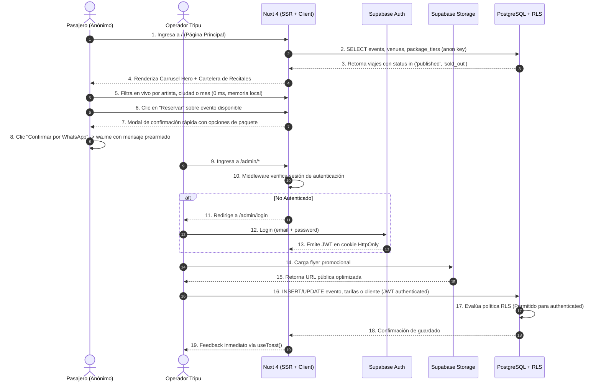
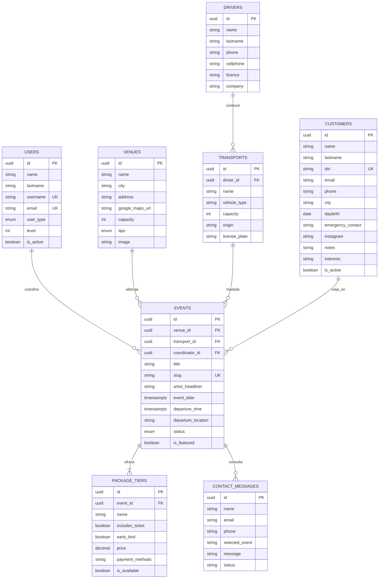

# Architecture

> **Documento Oficial de Arquitectura Técnica**  
> **Proyecto:** Tripu System  
> **Cliente / Marca:** Tripu Producciones  
> **Estado del Proyecto:** Sprint 1 a 5 Finalizados (Lanzamiento v1.0.0)  
> **Versión del Sistema:** v1.0.0 (292 Story Points completados de US-01 a US-13)  
> **Fuente de Verdad:** Código fuente verificado en repositorio Git (`event-system`), configuración Nuxt 4, dependencias y script DDL de PostgreSQL (`DB/schema.sql`).

---

## 1. Overview

**Tripu System** es una plataforma web integral orientada al descubrimiento, exploración y conversión comercial de **experiencias de viaje y traslados terrestres a conciertos, recitales y festivales masivos de música**.

La arquitectura técnica se sustenta en un modelo híbrido **Jamstack / Backend-as-a-Service (BaaS)** que combina:
* **Frontend Web Reactivo con Server-Side Rendering (SSR):** Desarrollado sobre **Nuxt 4** y **Vue 3**, garantizando renderizado veloz, hidratación eficiente y posicionamiento orgánico en motores de búsqueda (SEO).
* **Plataforma Pública de Exploración:** Diseñada con estética Dark Mode moderna y accesible (WCAG AA), permitiendo a los usuarios navegar el carrusel de destacados (`FeaturedCarousel.vue`), explorar la cartelera general de eventos (`EventCard.vue`), filtrar reactivamente en memoria por banda, ciudad o mes (`EventFilters.vue`) e iniciar consultas contextuales inmediatas hacia WhatsApp sin requerir registro de cuenta.
* **Panel Administrativo Protegido (`/admin`):** Interfaz operativa construida con componentes estandarizados de **Nuxt UI** para la gestión de flota, choferes, recintos destino, clientes/pasajeros (`/admin/clientes`), publicación de viajes con afiches promocionales y edición rápida de tarifas (`QuickPriceModal.vue`).
* **Backend y Capa de Persistencia:** Alojado sobre **Supabase Cloud**, utilizando **PostgreSQL 15+** como motor relacional (8 tablas protegidas), **Supabase Auth** para control de identidades administrativas mediante cookies seguras, **Supabase Storage** para almacenamiento de activos gráficos y **Row Level Security (RLS)** como mecanismo inviolable de autorización en base de datos.
* **Modelo Operativo de Costo Cero ($0/mes):** Diseñado para operar íntegramente sobre las capas gratuitas de Supabase, Vercel/Netlify y servicios auxiliares sin sacrificar seguridad ni rendimiento.

---

## 2. Product Architecture

El producto se estructura en dos superficies principales acopladas a una única capa centralizada de servicios BaaS:



---

## 3. Technology Stack

Tecnologías, librerías y versiones **realmente instaladas y verificadas** en el proyecto (`package.json` y `DB/schema.sql`):

| Capa / Subsistema | Tecnología Real | Versión Verificada | Propósito Técnico en el Sistema |
| :--- | :--- | :---: | :--- |
| **Framework Base** | Nuxt | `^4.5.2` | Framework fullstack sobre Vue 3, provee SSR, autoimports, routing basado en archivos y servidor Nitro. |
| **Librería UI Reactiva** | Vue 3 | `^3.5.43` | Motor reactivo con Composition API (`<script setup lang="ts">`) y TypeScript. |
| **Sistema de Diseño / UI** | `@nuxt/ui` | `^4.11.2` | Componentes accesibles preconstruidos (formularios, botones, modales, tarjetas) basados en Tailwind CSS y Nuxt Icon. |
| **Motor de Ruteo** | `vue-router` | `^5.3.1` | Gestión reactiva de rutas y navegación entre páginas. |
| **Backend as a Service (BaaS)** | `@nuxtjs/supabase` | `^2.0.10` | Conector oficial de Supabase para Nuxt, provee cliente composable (`useSupabaseClient`, `useSupabaseUser`). |
| **Motor de Base de Datos** | PostgreSQL (Supabase) | `15+` | Persistencia relacional, enums tipados, constraints de integridad referencial y funciones pgcrypto. |
| **Seguridad de Datos** | PostgreSQL RLS | Nativo | Políticas de Row Level Security por tabla, diferenciando accesos `anon` y `authenticated`. |
| **Gestión de Autenticación** | Supabase Auth (GoTrue) | Nativo | Emisión y validación de tokens JWT en cookies de sesión `HttpOnly`. |
| **Almacenamiento de Archivos** | Supabase Storage | Nativo | Bucket `tripu-assets` para afiches promocionales y activos institucionales. |
| **Procesamiento de Branding** | Pillow (Python pipeline) | `12.3.0` | Pipeline de recorte de márgenes transparentes y compresión WebP para assets oficiales en `public/branding/`. |
| **Esquemas de Validación** | Zod | `^4.6.5` | Validación y sanitización tipada de formularios e inputs antes de la persistencia. |
| **SEO y Sitemaps** | `@nuxtjs/sitemap` | `^8.5.1` | Generación dinámica de `sitemap.xml` para indexación de viajes y páginas institucionales. |

---

## 4. System Architecture

### Diagrama de Secuencia de Flujos Principales



### Límites Arquitectónicos (Public vs Admin Boundaries)
1. **Límite Público (Anónimo):**
   * El cliente anónimo solo tiene autorización de lectura sobre eventos en estado `published` o `sold_out`, recintos y paquetes activos.
   * La única mutación autorizada para clientes no autenticados es el envío de consultas a través de `contact_messages`.
   * El acceso a la web no requiere tokens ni cookies de autenticación (`supabase: { redirect: false }` en `nuxt.config.ts`).
2. **Límite Administrativo (Protegido):**
   * Toda ruta bajo `/admin/*` requiere validación de token JWT activo mediante `app/middleware/auth.ts`.
   * La interfaz de administración se ejecuta con layout aislado (`admin.vue`), barra de navegación interna y formularios con validación estricta Zod.
   * La base de datos rechaza a nivel de motor (PostgreSQL RLS) cualquier mutación que carezca de token `authenticated`.

---

## 5. Application Structure

El proyecto implementa la arquitectura de directorios oficial de **Nuxt 4**, donde el código de la aplicación se centraliza en la carpeta `app/`:

```text
event-system/
├── .env                              # Variables de entorno locales (git-ignored)
├── .env.example                      # Plantilla documentada de variables requeridas
├── .gitignore                        # Reglas de exclusión de Git (node_modules, .nuxt, .output)
├── ARCHITECTURE.md                   # Documentación oficial de arquitectura del sistema
├── CHANGELOG.md                      # Historial técnico acumulativo del desarrollo
├── nuxt.config.ts                    # Configuración de Nuxt, módulos, runtimeConfig y SEO
├── package.json                      # Manifiesto de dependencias y scripts de construcción
├── package-lock.json                 # Árbol de dependencias bloqueado
├── tsconfig.json                     # Configuración de compilación TypeScript
│
├── app/                              # Directorio raíz de aplicación (Convención Nuxt 4)
│   ├── app.vue                       # Entrada raíz: proveedor <UApp> y renderizador <NuxtPage>
│   ├── components/                   # Componentes visuales auto-importados
│   │   ├── CustomerTagInput.vue      # Selector y creador de tags dinámicos de intereses
│   │   ├── QuickPriceModal.vue       # Modal ágil de edición de tarifas (< 10s)
│   │   ├── FeaturedCarousel.vue      # Carrusel hero con doble scrim, autoplay y scroll glow
│   │   ├── EventCard.vue             # Tarjeta vertical 4:5 estilo póster de recital
│   │   └── EventFilters.vue          # Barra de búsqueda y filtros reactivos por ciudad/mes
│   ├── composables/                  # Lógica de dominio reactiva y llamadas a Supabase
│   │   ├── useCustomers.ts           # CRUD tipado para pasajeros y clientes (Caché ADR-05, TTL 5m)
│   │   ├── useDrivers.ts             # CRUD tipado para choferes (Caché ADR-05, TTL 5m)
│   │   ├── useTransports.ts          # CRUD tipado para flota con join relacional (Caché ADR-05, TTL 5m)
│   │   ├── useVenues.ts              # CRUD tipado para recintos y sedes (Caché ADR-05, TTL 30m)
│   │   ├── useEvents.ts              # CRUD y agenda de viajes con joins relacionales (Caché ADR-05, TTL 5m)
│   │   └── usePublicEvents.ts        # Catálogo público, destacados y filtros en memoria (TTL 3m)
│   ├── layouts/                      # Layouts reutilizables de interfaz
│   │   ├── default.vue               # Layout público con navbar sticky, logo WebP y footer institucional
│   │   └── admin.vue                 # Shell administrativo con barra de operador y logout resiliente
│   ├── middleware/                   # Middlewares de ruteo
│   │   └── auth.ts                   # Route guard que protege rutas /admin/* contra accesos anónimos
│   ├── pages/                        # Sistema de ruteo automático por archivos
│   │   ├── index.vue                 # Portada principal: Carrusel Hero, Cartelera y modal de reserva
│   │   └── admin/                    # Superficie administrativa protegida
│   │       ├── index.vue             # Dashboard operativo con KPIs y estado de infraestructura
│   │       ├── login.vue             # Pantalla de inicio de sesión con Supabase Auth y Zod
│   │       ├── choferes/             # Módulo de choferes profesionales
│   │       │   └── index.vue         # Maestro de choferes con CRUD, Zod y WhatsApp
│   │       ├── clientes/             # Módulo de clientes y pasajeros frecuentes
│   │       │   └── index.vue         # Maestro de clientes, buscador por DNI y gestión de tags
│   │       ├── recintos/             # Módulo de recintos, estadios y sedes
│   │       │   └── index.vue         # Maestro de recintos con aforo, filtros y Google Maps
│   │       ├── transportes/          # Módulo de flota de vehículos
│   │       │   └── index.vue         # Maestro de flota con presets, capacidad y asignación
│   │       ├── viajes/               # Módulo de salidas, agenda y publicación de viajes
│   │       │   ├── index.vue         # Tablero operativo de viajes, KPIs y estados
│   │       │   ├── nuevo.vue         # Asistente multi-bloque de publicación y tarifas
│   │       │   └── editar/           # Edición de viajes existentes
│   │       │       └── [id].vue      # Formulario de edición con reconciliación de tarifas
│   │       └── mensajes/             # Bandeja de consultas recibidas
│   │           └── index.vue         # Listado de consultas con filtros por estado
│   └── types/                        # Tipado estricto consumido por la aplicación
│       └── database.types.ts         # Definiciones TypeScript de las 8 tablas y enums
│
├── public/                           # Activos estáticos públicos servidos en raíz (/)
│   ├── favicon.ico                   # Ícono de pestaña del navegador
│   ├── robots.txt                    # Directivas de rastreo para motores de búsqueda
│   └── branding/                     # Logotipos vectoriales recortados y optimizados
│       ├── logo-tripu-horizontal.webp# Logotipo horizontal oficial (Rojo + Crema)
│       ├── logo-tripu-horizontal-sm.webp # Versión web ultraligera (34 KB)
│       ├── logo-tripu-badge-sm.webp  # Sello circular oficial de marca (51 KB)
│       ├── paleta-de-colores.webp    # Guía oficial de identidad comprimida
│       └── raw/                      # Respaldo de archivos PNG originales sin compresión
```

---

## 6. Frontend Architecture

### 1. Vue 3 y Composition API
* Todo componente y página se desarrolla exclusivamente con la sintaxis `<script setup lang="ts">`.
* Se prohíbe el uso de la Options API tradicional en favor de la reactividad basada en primitivas `ref`, `reactive` y `computed`.

### 2. Arquitectura de Componentes y Sistema de Diseño
* **Tokens de Color Oficiales:**
  * **Acento Primario (Rojo Tripu):** `#E53924` (CTAs, alertas, hover, badges glowing).
  * **Color Neutro Tipográfico (Crema / Marfil):** `#F5EEDC` (Títulos de artistas y textos de alto contraste).
  * **Fondo Principal (Dark Canvas):** `#0F0F12` (Fondo de toda la web).
  * **Superficie de Tarjetas (Dark Surface):** `#14141B` y `#1A1A22` (Contenedores y tarjetas).
  * **Bordes y Divisores:** `#2A2A38` (Líneas divisorias y estados inactivos).
  * **Naranja Fuego:** `#FF6B55` / `#FF5733` (Fechas y micro-etiquetas).
  * **Conversión (WhatsApp):** `#25D366` (Canal prioritario de ventas y consultas).

---

## 7. Public Platform

### Estado Actual de Implementación (Sprint 3 & Sprint 4)
La plataforma pública cuenta con dos vistas principales utilizando el layout público [`app/layouts/default.vue`](file:///c:/Users/USUARIO/Desktop/myself/PROJECTS/tripusystem/GIT_REPO/event-system/app/layouts/default.vue):

1. **Carrusel Hero de Destacados (`FeaturedCarousel.vue`):**
   * Altura de 640px en notebooks y desktops con soporte para transiciones automáticas y táctiles.
   * Doble gradiente scrim para garantizar legibilidad WCAG AA sobre cualquier fotografía de concierto.
   * **Botón Suspendido con Efecto Nuxt-DevTools Glow:** Botón flotante centrado al pie del carrusel con movimiento de levitación continua (`animate-suspension`, 0 a 7px en 2.2s). Al hacer hover, activa un aura difusa exterior y un borde cónico giratorio a 360° (`@keyframes devtools-spin`), invitando al usuario a desplazarse hacia la cartelera.
   * Botón de acción directa con navegación a la ficha de viaje (`/viajes/[slug]`) en nueva pestaña.
2. **Cartelera General de Recitales (`EventCard.vue`):**
   * Grilla responsiva de 4 columnas en desktop (`xl:grid-cols-4`).
   * Tarjetas estilo póster vertical (4:5) con tira inferior `"ENTRADAS DISPONIBLES"` y cartel central `"AGOTADO"` para salidas completas.
   * **Navegación directa:** Al hacer clic en un viaje disponible, navega a la ficha detallada (`/viajes/[slug]`) en la misma pestaña mediante `navigateTo()`, asegurando una transición SPA fluida y limpia.
   * **Inhabilitación defensiva de eventos agotados:** Bloqueo de clics y botón CTA deshabilitado (`cursor-not-allowed`, `:disabled="isSoldOut"`).
3. **Barra de Búsqueda y Filtros Reactivos (`EventFilters.vue`):**
   * Búsqueda por texto en tiempo real, selector desplegable de ciudades y filtro por mes.
   * Ejecución en memoria del cliente a 0 ms sin peticiones de red redundantes.
4. **Ficha Detallada de Viaje (`app/pages/viajes/[slug].vue` - US-09):**
   * Renderizado en servidor (SSR) mediante `fetchPublicEventBySlug(slug)` con caché `useState` en memoria (ADR-05).
   * Manejo de error 404 defensivo si la salida no existe o no está publicada.
   * Ficha editorial con póster, metadatos de show, punto y horario de salida, política de regreso e itinerario detallado.
   * Comparador visual de opciones de paquetes y preventas (`package_tiers`).
   * Metadatos dinámicos OpenGraph y Twitter Cards (`useSeoMeta`).
   * Conversión contextual inteligente a WhatsApp (US-10) en desktop y barra flotante sticky en mobile.

---

## 8. Admin Platform

El panel administrativo (`/admin/*`) cuenta con los siguientes módulos operativos:
* **`/admin/login` (✅ Implementado):** Autenticación administrativa por email/password con Supabase Auth y Zod.
* **`/admin/index` (✅ Implementado):** Tablero principal con métricas de viajes y recuentos de flota, choferes y recintos consumidos en tiempo real.
* **`/admin/viajes` (✅ Implementado):** Tablero operativo de agenda con tarjetas de KPIs, filtros por estado y selector rápido.
* **`/admin/viajes/nuevo` (✅ Implementado):** Asistente multi-bloque de publicación de salidas y repetidor dinámico de tarifas.
* **`/admin/viajes/editar/[id]` (✅ Implementado):** Edición completa de viaje con reconciliación de `package_tiers`.
* **`QuickPriceModal.vue` (✅ Implementado):** Modal ágil para actualización de precios y preventas en menos de 10 segundos.
* **`/admin/clientes` (✅ Implementado):** Maestro de clientes y pasajeros con búsqueda instantánea por DNI, gestión de etiquetas dinámicas de intereses (`CustomerTagInput.vue`) y métricas de pasajeros activos.
* **`/admin/transportes` (✅ Implementado):** Maestro de flota con CRUD completo, presets de capacidad (19 a 60 pax) y asignación de chofer.
* **`/admin/choferes` (✅ Implementado):** Directorio de choferes con números de guardia, licencias CNRT y enlaces directos a WhatsApp.
* **`/admin/recintos` (✅ Implementado):** Maestro de estadios y recintos con aforo oficial, geolocalización directa con Google Maps y validación Zod.
* **`/admin/mensajes` (✅ Implementado - US-11):** Bandeja operativa de consultas recibidas desde la web pública con filtros por estado (*nuevo*, *leído*, *respondido*, *archivado*), buscador en tiempo real, visor modal de mensaje completo y respuestas ágiles por correo o WhatsApp.
* **`/contacto` (✅ Implementado - US-11):** Página pública con formulario Dark Mode accesible, validación Zod (`shared/schemas/contact.ts`), honeypot antispam y endpoint de servidor Nitro (`server/api/contact.post.ts`) con despacho resiliente vía Resend.

---

## 9. Domain Architecture

El dominio de negocio de **Tripu System** se estructura alrededor de 7 entidades operativas y 1 entidad de auditoría:



---

## 10. Data Architecture

El flujo de información en la aplicación responde a dos circuitos claramente definidos según el privilegio del actor:

### Circuito 1: Consulta Pública (Solo Lectura)
```text
Usuario Anónimo -> Navega página / -> Nuxt SSR (useAsyncData)
    -> Cliente Supabase (SUPABASE_KEY pública / anon)
    -> PostgreSQL -> Evaluación RLS: Policy "Lectura pública"
    -> Filtra registros con status in ('published', 'sold_out')
    -> usePublicEvents almacena en memoria reactiva (TTL 3m)
    -> Retorna datos sanitizados al cliente sin credenciales privadas.
```

### Circuito 2: Gestión Administrativa (Mutación Protegida)
```text
Operador Tripu -> Ingresa datos en formulario Nuxt UI
    -> Validación en cliente con esquema Zod
    -> Subida de imagen a Supabase Storage (si aplica) -> Recibe URL pública
    -> Cliente Supabase ejecuta INSERT/UPDATE enviando Header Authorization (Bearer JWT)
    -> PostgreSQL -> Evaluación RLS: Policy "Operadores controlan ..." (auth.role() = 'authenticated')
    -> Validación de restricciones de tabla (check_user_level, FKs, Unique Slugs, Unique DNI)
    -> Confirmación de persistencia -> Mutación local en memoria (0 ms) -> useToast.
```

---

## 11. Database Architecture

La base de datos relacional PostgreSQL cuenta con 8 tablas principales formalizadas en `DB/schema.sql`:

### Tipos Enumerados (ENUMs)
1. `user_type_enum`: `'MASTER'`, `'CHIEF_TRIPU'`, `'JEFE'`, `'COORDINADOR'`, `'MARINERO'`, `'PASAJERO'`.
2. `venue_type_enum`: `'estadio'`, `'campo'`, `'arena'`, `'club'`, `'sala'`, `'estudio'`, `'boliche'`, `'bar'`, `'sitio_publico'`, `'edificio'`, `'predio'`, `'complejo'`.
3. `event_status_enum`: `'draft'`, `'published'`, `'sold_out'`, `'completed'`, `'canceled'`, `'rescheduled'`.

### Resumen de Tablas y Reglas de Integridad
* **`public.users`:** Usuarios administrativos del sistema con rol tipado y restricción `check_user_level`.
* **`public.drivers`:** Choferes profesionales con datos de licencia y empresa titular.
* **`public.transports`:** Vehículos de flota con capacidad de plazas (19 a 60 pax), patente y relación `driver_id`.
* **`public.venues`:** Recintos y estadios destino con aforo oficial, dirección e imagen.
* **`public.events`:** Salidas y viajes con slug canónico único, relaciones a recinto, transporte y coordinador.
* **`public.package_tiers`:** Opciones de paquete y tarifas asociadas a un viaje (`ON DELETE CASCADE`).
* **`public.customers`:** Directorio de clientes y pasajeros con DNI único, fecha de nacimiento, contacto de emergencia, notas internas y gustos musicales serializados (`"array:rock,los-piojos"`).
* **`public.contact_messages`:** Mensajes recibidos desde el formulario web con estado por defecto `'pending'`.

---

## 12. Supabase Architecture

Tripu System utiliza **Supabase Cloud** como backend unificado (BaaS) explotando cuatro de sus motores nativos:
1. **PostgreSQL Engine:** Persistencia relacional, transacciones ACID y evaluación nativa de políticas RLS.
2. **Supabase Auth:** Emisión de tokens de acceso JWT, gestión de identidades de operadores, refresco automático de tokens y persistencia segura en cookies `HttpOnly`.
3. **Supabase Storage:** Almacenamiento distribuido de objetos estáticos para afiches bajo el bucket `tripu-assets`.
4. **Supabase PostgREST API:** Capa de acceso a datos que mapea el esquema relacional a consultas directas desde el cliente Nuxt con tipado TypeScript generado.

---

## 13. Authentication & Authorization

El sistema distingue de forma estricta entre **Autenticación** y **Autorización**:
* **Autenticación:** Validada por Supabase Auth mediante credenciales (email normalizado + password). Emite tokens JWT con claim `auth.role() = 'authenticated'` persistidos en cookies seguras.
* **Autorización:** Doble barrera (Middleware Nuxt en cliente/SSR + Row Level Security en PostgreSQL).

---

## 14. Row Level Security

El sistema aplica **Row Level Security (RLS) obligatorio** sobre el 100% de las 8 tablas relacionales:

```sql
alter table public.users enable row level security;
alter table public.drivers enable row level security;
alter table public.transports enable row level security;
alter table public.venues enable row level security;
alter table public.events enable row level security;
alter table public.package_tiers enable row level security;
alter table public.contact_messages enable row level security;
alter table public.customers enable row level security;
```

### Matriz de Políticas RLS Activas

| Tabla | Operación | Rol Permitido | Condición de Política (`USING` / `WITH CHECK`) |
| :--- | :---: | :---: | :--- |
| **`venues`** | `SELECT` | `anon`, `authenticated` | `true` (Lectura pública general). |
| **`venues`** | `ALL` | `authenticated` | `true` (Operadores gestionan recintos). |
| **`events`** | `SELECT` | `anon` | `status in ('published', 'sold_out')` (Viajes públicos activos). |
| **`events`** | `ALL` | `authenticated` | `true` (Operadores controlan todos los viajes). |
| **`package_tiers`** | `SELECT` | `anon` | `is_available = true` (Opciones vigentes). |
| **`package_tiers`** | `ALL` | `authenticated` | `true` (Operadores controlan paquetes y precios). |
| **`contact_messages`**| `INSERT`| `anon` | `true` (Público puede enviar consultas). |
| **`contact_messages`**| `ALL` | `authenticated` | `true` (Operadores leen y administran consultas). |
| **`users`** | `ALL` | `authenticated` | `true` (Solo operadores autenticados gestionan usuarios). |
| **`drivers`** | `ALL` | `authenticated` | `true` (Solo operadores autenticados gestionan choferes). |
| **`transports`** | `ALL` | `authenticated` | `true` (Solo operadores autenticados gestionan flota). |
| **`customers`** | `ALL` | `authenticated` | `true` (Privacidad estricta: solo operadores gestionan clientes). |

---

## 15. Storage Architecture

* **Bucket Principal:** `tripu-assets` (Público para lectura de imágenes optimizadas).
* **Carpetas:** `flyers/` (Afiches de recitales), `gallery/` (Fotos reales de contingentes), `venues/` (Fotos de recintos).
* **Políticas:** Lectura pública para cualquier usuario; subida y borrado restringido a usuarios `authenticated`.

---

## 16. Validation

La estrategia de validación se fundamenta en **Zod (`zod`)**:
* **Contratos Fuertes (Schema-First):** Todo formulario de creación o edición cuenta con un esquema Zod que define tipos, longitudes mínimas y mensajes de error en español.
* **Componentes Compatibles:** Validación reactiva conectada mediante `<UFormField :error="...">` y validación programática antes de la persistencia.

---

## 17. API & Data Access

El acceso a datos prescinde de una API REST intermedia propia para operaciones CRUD estándar, adoptando el patrón BaaS nativo:
1. **Acceso Directo vía Composable:** Nuxt consume datos directamente desde PostgreSQL a través de `useSupabaseClient<Database>()`.
2. **Consultas Fuertemente Tipadas:** El cliente Supabase está parametrizado con `Database` desde `app/types/database.types.ts`.
3. **Rutas de Servidor Nitro (`server/api/*`):** Reservadas para integraciones con terceros (Resend, webhooks).

---

## 18. SEO Architecture

* **Server-Side Rendering (SSR):** El HTML de la cartelera se pre-renderiza en el servidor.
* **Metadatos Semánticos Dinámicos:** Configurados en `app/pages/index.vue` y `app.vue` con OpenGraph, descripción y tarjeta social oficial (`/branding/logo-tripu-horizontal.webp`).
* **Directivas para Crawlers (`public/robots.txt`):** Permite indexación pública y bloquea `/admin/` y `/api/`.
* **Sitemap Dinámico:** Generado por `@nuxtjs/sitemap` sobre `https://www.tripu.com.ar`.

---

## 19. State Management

Tripu System adopta una estrategia pragmática de ultra alto rendimiento para la gestión de estado sin librerías externas pesadas:
* **Estado Local de Componentes:** Primitivas reactivas `ref()` y `reactive()`.
* **Lógica Derivada:** Propiedades computadas (`computed()`) para filtrado en memoria a 0 ms.
* **Estado Compartido y Caché Global:** Gestionado mediante `useState` con Time-To-Live (TTL) y deduplicación de consultas concurrentes.

### Matriz de TTL y Composables de Dominio (ADR-05)

| Composable | Claves de Estado (`useState`) | TTL | Propósito |
| :--- | :--- | :---: | :--- |
| **`useCustomers`** | `tripu-customers-data`, `timestamp`, `loading` | **5 min** | Directorio de clientes y pasajeros frecuentes. |
| **`useEvents`** | `tripu-events-data`, `timestamp`, `loading` | **5 min** | Agenda operativa de viajes y tarifas completas. |
| **`usePublicEvents`**| `tripu-public-featured-*`, `tripu-public-all-*` | **3 min** | Catálogo público, banner hero y filtros en memoria. |
| **`useDrivers`** | `tripu-drivers-data`, `timestamp`, `loading` | **5 min** | Directorio de choferes profesionales. |
| **`useTransports`** | `tripu-transports-data`, `timestamp`, `loading` | **5 min** | Flota vehicular con chofer asignado. |
| **`useVenues`** | `tripu-venues-data`, `timestamp`, `loading` | **30 min** | Recintos y estadios (baja volatilidad). |

* **Higiene de Memoria:** Al invocar `handleLogout()` en `app/layouts/admin.vue`, se purgan todos los estados en memoria (`clearCustomersState()`, `clearEventsState()`, etc.) para proteger terminales compartidas.

---

## 20. Error Handling

1. **Captura y Feedback:** Errores de PostgREST capturados en bloques `try/catch` con notificación amigable vía `useToast()`.
2. **Página de Error Personalizada (`error.vue`):** Captura de errores 404 y 500 con diseño Dark Mode y botón de retorno al inicio.
3. **Cierre de Sesión Resiliente:** Si `supabase.auth.signOut()` experimenta fallas de red, la sesión local se purga de forma incondicional (`user.value = null`), garantizando que el operador no quede atrapado.

---

## 21. Testing Strategy

* **Estado Actual:** Verificación estricta de compilación (`npm run build`) con tipado estricto en TypeScript sin errores.
* **Fases Posteriores:** Suite planificada con Vitest (pruebas de esquemas Zod) y Playwright (flujos E2E de conversión a WhatsApp y login).

---

## 22. Configuration & Environment

Variables de entorno requeridas en `.env.example`:
* **Públicas:** `SUPABASE_URL`, `SUPABASE_KEY` (`anon-key`), `NUXT_PUBLIC_SITE_URL`, `NUXT_PUBLIC_WHATSAPP_NUMBER`.
* **Privadas de Servidor:** `RESEND_API_KEY`, `CONTACT_RECEIVER_EMAIL`.

---

## 23. Security

1. **Aislamiento en Base de Datos (RLS):** 100% de tablas protegidas a nivel de motor.
2. **Cookies Seguras:** Tokens JWT gestionados en cookies `HttpOnly` seguras.
3. **Cabeceras HTTP de Seguridad:** Inyectadas en `nuxt.config.ts` (`HSTS`, `X-Content-Type-Options: nosniff`, `X-Frame-Options: DENY`, `Referrer-Policy`).
4. **Protección de Enlaces Externos:** Enlaces a WhatsApp y redes implementan `rel="noopener noreferrer"`.
5. **Sanitización de Datos:** Limpieza estricta de cadenas en formularios con esquemas Zod.

---

## 24. Deployment & Infrastructure

* **Alojamiento Frontend:** Diseñado para despliegue serverless en **Vercel** o **Netlify** con CI/CD automático desde Git.
* **Base de Datos:** Instancia gestionada en **Supabase Cloud**.
* **Dominio Oficial:** `www.tripu.com.ar` con SSL/TLS 1.3 automático.

---

## 25. Observability

* **Entorno Local:** Nuxt DevTools activo para inspección reactiva de estado y componentes.
* **Producción:** Registros nativos de base de datos, autenticación y storage provistos por Supabase Cloud Dashboard.

---

## 26. Architectural Decisions

### ADR-01: Adopción de Nuxt 4 como Framework Fullstack
* **Estado:** Aceptado.
* **Motivo:** Combina SSR de alto rendimiento para SEO en espectáculos con reactividad ágil de cliente.

### ADR-02: Supabase como Plataforma BaaS
* **Estado:** Aceptado.
* **Motivo:** Provee PostgreSQL relacional, Auth y Storage bajo costo de infraestructura inicial de $0/mes.

### ADR-03: Row Level Security (RLS) como Mecanismo Primario de Autorización
* **Estado:** Aceptado.
* **Motivo:** Garantiza aislamiento inviolable de datos directamente en el motor de base de datos.

### ADR-04: Conversión Comercial Vía WhatsApp y Pagos Fuera de Plataforma
* **Estado:** Aceptado.
* **Motivo:** Elimina fricción de registro para los pasajeros y replica el canal donde Tripu cierra sus reservas con alta efectividad.

### ADR-05: Caché Global en Memoria con useState y TTL como Estándar de Gestión de Estado
* **Estado:** Aceptado (Precedente obligatorio para todos los composables de dominio).
* **Motivo:** Para un equipo de 3 operadores concurrentes, prioriza navegación con latencia de 0 ms y minimiza peticiones a Supabase.

### ADR-06: Estructuras Semánticas HTML Nativas y Adaptación Nuxt UI v3
* **Estado:** Aceptado.
* **Contexto:** En Nuxt UI v3, ciertos wrappers de tablas basados en TanStack o componentes en evolución generaban fallos de hidratación y desajustes de tipos en props (`ui`).
* **Decisión:** Emplear estructuras semánticas HTML nativas (`<table>`, selectores nativos accesibles) encapsuladas dentro de `<UCard>`, y migrar `<UFormGroup>` hacia `<UFormField>`.
* **Motivo:** Elimina dependencias inestables de renderizado, garantiza cero advertencias de Vue y asegura compatibilidad a largo plazo.

### ADR-07: Doble Capa Scrim y Microinteracciones Guiadas en Portada Pública
* **Estado:** Aceptado.
* **Contexto:** Los afiches promocionales de recitales tienen colores impredecibles que pueden dificultar la lectura de títulos blancos/crema. Además, el carrusel hero de 640px ocupa toda la pantalla en notebooks, ocultando la cartelera inferior.
* **Decisión:** Implementar un gradiente doble (horizontal y vertical) como scrim protector sobre la imagen, e incorporar un botón flotante suspendido con animación continua y efecto glowing que invite y desplace suavemente hacia el catálogo comercial.
* **Motivo:** Cumple con la pauta de accesibilidad WCAG AA (contraste mínimo 4.5:1) y maximiza la tasa de conversión guiando al usuario hacia las tarjetas de venta.

---

## 27. Known Constraints

1. **Límites de la Capa Gratuita de Supabase:** 500 MB en base de datos y 1 GB en storage (adecuado para el volumen actual de la Pyme).
2. **Dependencia de WhatsApp:** La conversión inmediata depende de la disponibilidad del servicio de mensajería.
3. **Flujo de Pago Off-Platform:** La confirmación de señas y cobros se realiza manualmente por el operador.

---

## 28. Future Considerations

* **CURRENT (Estado Real Actual - v0.9.5):** 8 tablas relacionales con RLS activo, portal web público interactivo con Hero Carrusel, Cartelera General (tarjetas póster 4:5), Filtros reactivos en memoria, Panel Administrativo completo con 6 módulos operativos (Viajes, Clientes, Flota, Choferes, Recintos, Mensajes), y documentación sincronizada en `CHANGELOG.md` y `ARCHITECTURE.md`.
* **FUTURE (Próximas Fases del Roadmap):**
  * **US-10:** Ficha Detallada del Viaje (`/viajes/[slug]`) con apertura en nueva pestaña (`target="_blank"`), itinerario punto a punto y desglose de comodidades.
  * Suite de pruebas automatizadas con Vitest y Playwright.
  * Integración de monitoreo con Sentry para producción.
