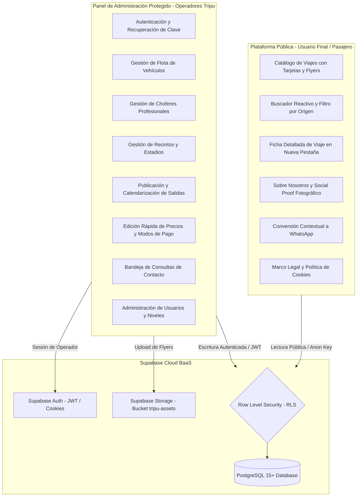
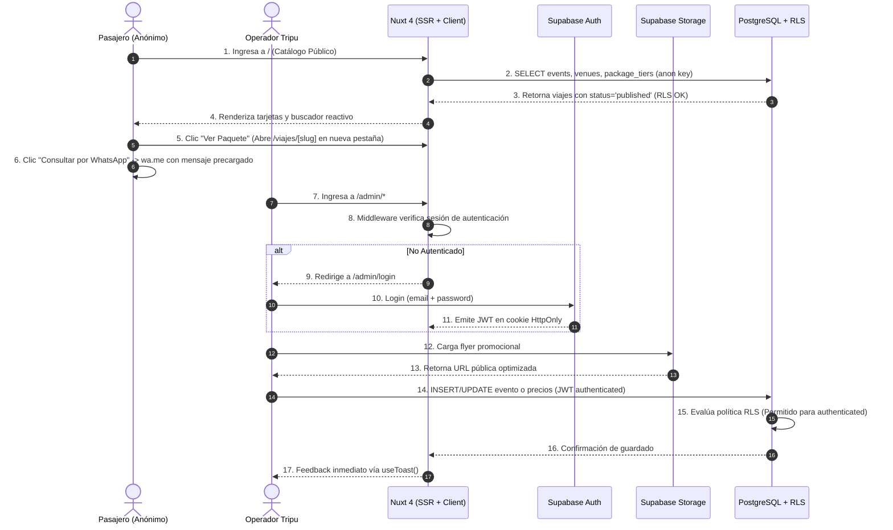
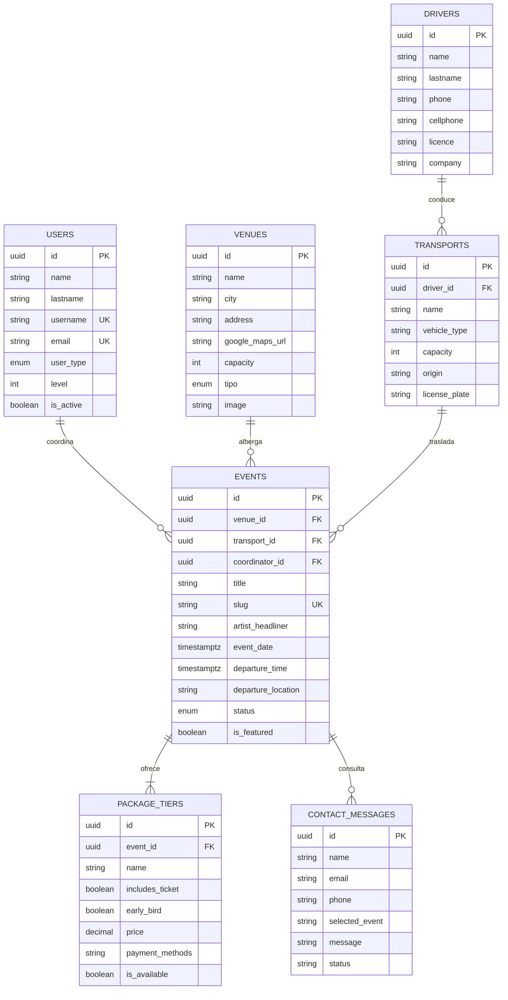

# Architecture

> **Documento Oficial de Arquitectura Técnica**  
> **Proyecto:** Tripu System  
> **Cliente / Marca:** Tripu Producciones  
> **Estado del Proyecto:** En Desarrollo Activo (Sprint 1)  
> **Fuente de Verdad:** Código fuente verificado en repositorio Git (`event-system`), configuración Nuxt 4, dependencias y script DDL de PostgreSQL (`DB/schema.sql`).

---

## 1. Overview

**Tripu System** es una plataforma web integral orientada al descubrimiento, exploración y conversión comercial de **experiencias de viaje y traslados terrestres a conciertos, recitales y festivales masivos de música**.

La arquitectura técnica se sustenta en un modelo híbrido **Jamstack / Backend-as-a-Service (BaaS)** que combina:
* **Frontend Web Reactivo con Server-Side Rendering (SSR):** Desarrollado sobre **Nuxt 4** y **Vue 3**, garantizando renderizado veloz, hidratación eficiente y posicionamiento orgánico en motores de búsqueda (SEO).
* **Plataforma Pública de Exploración:** Diseñada con estética Dark Mode moderna y accesible (WCAG AA), permitiendo a los usuarios navegar anónimamente el catálogo de viajes, buscar por artista, filtrar por ciudad de salida e iniciar consultas contextuales inmediatas hacia WhatsApp sin requerir registro de cuenta.
* **Panel Administrativo Protegido (`/admin`):** Interfaz operativa construida con componentes estandarizados de **Nuxt UI** para la gestión de flota, choferes, recintos destino, publicación de viajes con afiches promocionales y edición rápida de tarifas.
* **Backend y Capa de Persistencia:** Alojado sobre **Supabase Cloud**, utilizando **PostgreSQL 15+** como motor relacional, **Supabase Auth** para control de identidades administrativas mediante cookies seguras, **Supabase Storage** para almacenamiento de activos gráficos y **Row Level Security (RLS)** como mecanismo inviolable de autorización en base de datos.
* **Modelo Operativo de Costo Cero ($0/mes):** Diseñado para operar íntegramente sobre las capas gratuitas de Supabase, Vercel/Netlify y servicios auxiliares sin sacrificar seguridad ni rendimiento.

---

## 2. Product Architecture

El producto se estructura en dos superficies principales acopladas a una única capa centralizada de servicios BaaS:



---

## 3. Technology Stack

Tecnologías, librerías y versiones **realmente instaladas y verificadas** en el proyecto (`package.json` y `DB/schema.sql`):

| Capa / Subsistema | Tecnología Real | Versión Verificada | Propósito Técnico en el Sistema |
| :--- | :--- | :---: | :--- |
| **Framework Base** | Nuxt | `^4.5.2` | Framework fullstack sobre Vue 3, provee SSR, autoimports, routing basado en archivos y servidor Nitro. |
| **Librería UI Reactiva** | Vue 3 | `^3.5.43` | Motor reactivo con Composition API (`<script setup lang="ts">`) y TypeScript. |
| **Sistema de Diseño / UI** | `@nuxt/ui` | `^4.11.2` | Componentes accesibles preconstruidos (formularios, botones, modales, tablas) basados en Tailwind CSS y Nuxt Icon. |
| **Motor de Ruteo** | `vue-router` | `^5.3.1` | Gestión reactiva de rutas y navegación entre páginas. |
| **Backend as a Service (BaaS)** | `@nuxtjs/supabase` | `^2.0.10` | Conector oficial de Supabase para Nuxt, provee cliente composable (`useSupabaseClient`, `useSupabaseUser`). |
| **Motor de Base de Datos** | PostgreSQL (Supabase) | `15+` | Persistencia relacional, enums tipados, constraints de integridad referencial y funciones pgcrypto. |
| **Seguridad de Datos** | PostgreSQL RLS | Nativo | Políticas de Row Level Security por tabla, diferenciando accesos `anon` y `authenticated`. |
| **Gestión de Autenticación** | Supabase Auth (GoTrue) | Nativo | Emisión y validación de tokens JWT en cookies de sesión `HttpOnly`. |
| **Almacenamiento de Archivos** | Supabase Storage | Nativo | Bucket `tripu-assets` para afiches promocionales y activos institucionales. |
| **Esquemas de Validación** | Zod | `^4.6.5` | Validación y sanitización tipada de formularios e inputs antes de la persistencia. |
| **SEO y Sitemaps** | `@nuxtjs/sitemap` | `^8.5.1` | Generación dinámica de `sitemap.xml` para indexación de viajes y páginas institucionales. |

---

## 4. System Architecture

### Diagrama de Arquitectura del Sistema



### Límites Arquitectónicos (Public vs Admin Boundaries)
1. **Límite Público (Anónimo):**
   * El cliente anónimo solo tiene autorización de lectura sobre eventos en estado `published`, recintos y paquetes activos.
   * La única mutación autorizada para clientes no autenticados es el envío de consultas a través de `contact_messages`.
   * El acceso a la web no requiere tokens ni cookies de autenticación (`supabase: { redirect: false }` en `nuxt.config.ts`).
2. **Límite Administrativo (Protegido):**
   * Toda ruta bajo `/admin/*` requiere validación de token JWT activo.
   * La interfaz de administración se ejecuta con layout aislado (`admin.vue`), barra de navegación interna y formularios con validación estricta Zod.
   * La base de datos rechaza a nivel de motor (PostgreSQL RLS) cualquier mutación que carezca de token `authenticated`.

---

## 5. Application Structure

El proyecto implementa la arquitectura de directorios oficial de **Nuxt 4**, donde el código de la aplicación se centraliza en la carpeta `app/`:

```text
event-system/
├── .env                              # Variables de entorno locales (git-ignored)
├── .env.example                      # Plantilla documentada de variables requeridas
├── .gitignore                        # Reglas de exclusión de Git (node_modules, .nuxt, .output)
├── ARCHITECTURE.md                   # Documentación oficial de arquitectura del sistema
├── CHANGELOG.md                      # Historial técnico acumulativo del desarrollo
├── nuxt.config.ts                    # Configuración de Nuxt, módulos, runtimeConfig y SEO
├── package.json                      # Manifiesto de dependencias y scripts de construcción
├── package-lock.json                 # Árbol de dependencias bloqueado
├── tsconfig.json                     # Configuración de compilación TypeScript
│
├── app/                              # Directorio raíz de aplicación (Convención Nuxt 4)
│   ├── app.vue                       # Entrada raíz: proveedor <UApp> y renderizador <NuxtPage>
│   ├── composables/                  # Lógica de dominio reactiva y llamadas a Supabase
│   │   ├── useDrivers.ts             # CRUD tipado para choferes
│   │   └── useTransports.ts          # CRUD tipado para flota con join relacional
│   ├── layouts/                      # Layouts reutilizables de interfaz
│   │   └── admin.vue                 # Shell administrativo con barra de operador y logout
│   ├── middleware/                   # Middlewares de ruteo
│   │   └── auth.ts                   # Route guard que protege rutas /admin/* contra accesos anónimos
│   ├── pages/                        # Sistema de ruteo automático por archivos
│   │   ├── index.vue                 # Portada principal y catálogo de viajes
│   │   └── admin/                    # Superficie administrativa protegida
│   │       ├── index.vue             # Dashboard operativo con KPIs y estado de infraestructura
│   │       ├── login.vue             # Pantalla de inicio de sesión con Supabase Auth y Zod
│   │       ├── choferes/             # Módulo de choferes profesionales
│   │       │   └── index.vue         # Maestro de choferes con CRUD, Zod y WhatsApp
│   │       └── transportes/          # Módulo de flota de vehículos
│   │           └── index.vue         # Maestro de flota con presets, capacidad y asignación
│   └── types/                        # Tipado estricto consumido por la aplicación
│       └── database.types.ts         # Definiciones TypeScript de tablas y enums de Supabase
│
├── public/                           # Activos estáticos públicos servidos en raíz (/)
│   ├── favicon.ico                   # Ícono de pestaña del navegador
│   └── robots.txt                    # Directivas de rastreo para motores de búsqueda
│
└── types/                            # Tipado auxiliar a nivel de proyecto
    └── database.types.ts             # Réplica de tipos de base de datos
```

### Responsabilidades y Reglas de Dependencia por Directorio

* **`app/`:**
  * *Responsabilidad:* Aloja todo el código que compone el runtime de cliente y servidor de la aplicación (componentes, vistas, composables, middleware).
  * *Regla:* Todo el código de Vue debe residir aquí. Nunca debe importar credenciales privadas como `SUPABASE_SERVICE_ROLE_KEY`.
* **`app/pages/`:**
  * *Responsabilidad:* Vistas mapeadas directamente a URLs.
  * *Regla:* Las páginas deben actuar como orquestadores limpios de componentes, delegando lógica de datos a composables.
* **`app/types/`:**
  * *Responsabilidad:* Contratos de datos estáticos en TypeScript.
  * *Regla:* Define la interfaz `Database` que parametriza el cliente de Supabase (`useSupabaseClient<Database>()`).
* **`public/`:**
  * *Responsabilidad:* Archivos estáticos accesibles directamente vía URL pública.
  * *Regla:* No debe contener código fuente ni información sensible.
* **`server/` (Previsto para Sprint 5):**
  * *Responsabilidad:* Rutas de servidor Nitro (`/api/*`).
  * *Regla:* Es el **único lugar del sistema** autorizado para consumir variables de servidor confidenciales (ej. `RESEND_API_KEY`).

---

## 6. Frontend Architecture

### 1. Vue 3 y Composition API
* Todo componente y página se desarrolla exclusivamente con la sintaxis `<script setup lang="ts">`.
* Se prohíbe el uso de la Options API tradicional en favor de la reactividad basada en primitivas `ref`, `reactive` y `computed`.

### 2. Arquitectura de Componentes (Nuxt UI)
* La interfaz reutiliza componentes accesibles de `@nuxt/ui` construidos sobre Headless UI y Tailwind CSS:
  * `<UApp>`: Proveedor contextual de temas y modales en `app.vue`.
  * `<UButton>`: Botones de acción, CTAs de WhatsApp y accesos administrativos.
  * `<UCard>`: Contenedores con elevación visual (`#1A1A22`) para el catálogo y el panel.
  * `<UTable>`, `<UModal>`, `<UForm>`: Componentes clave para los CRUDs del panel.

### 3. Server-Side Rendering (SSR) e Hidratación
* Nuxt ejecuta SSR sobre el motor **Nitro**, pre-renderizando el HTML del catálogo en el servidor.
* Esto garantiza que los rastreadores de Google reciban el contenido completo de los recitales y fechas sin depender de la ejecución de JavaScript en el cliente, optimizando el First Contentful Paint (FCP) y el Cumulative Layout Shift (CLS).

### 4. Sistema de Diseño y Tokens de Color
* La interfaz utiliza una paleta estandarizada basada en la identidad oficial de Tripu Producciones:
  * **Acento Primario (Rojo Tripu):** `#E53924` (CTAs, alertas, hover).
  * **Color Neutro Tipográfico (Crema / Marfil):** `#F5EEDC` (Títulos y textos de alto contraste).
  * **Fondo Principal (Dark Canvas):** `#0F0F12` (Fondo de toda la web).
  * **Superficie de Tarjetas (Dark Surface):** `#1A1A22` (Contenedores y tarjetas).
  * **Bordes y Divisores:** `#2A2A38` (Líneas divisorias y estados inactivos).
  * **Conversión (WhatsApp):** `#25D366` (Canal prioritario de ventas).

---

## 7. Public Platform

### Estado Actual de Implementación
* La ruta raíz `/` se encuentra implementada en `app/pages/index.vue`, sirviendo actualmente como pantalla de verificación técnica del stack (Nuxt UI, Dark Theme y módulos conectados).

### Arquitectura Planificada de Páginas Públicas
* **`/` (Portada y Catálogo):**
  * Hero Section con título de atracción y CTA visible *above the fold*.
  * Carrusel de eventos destacados (`is_featured = true`).
  * Grilla reactiva de tarjetas de eventos (`EventCard.vue`) con jerarquía: Artista $\rightarrow$ Fecha $\rightarrow$ Lugar $\rightarrow$ Ciudad de Origen.
  * Buscador reactivo en vivo por texto y selector de ciudad de salida.
* **`/viajes/[slug]` (Ficha Detallada de Viaje):**
  * Se abre obligatoriamente en **nueva pestaña** (`target="_blank" rel="noopener noreferrer"`) para preservar la búsqueda del usuario.
  * Muestra el itinerario completo, punto de encuentro, políticas de regreso post-show y desglose de paquetes disponibles con precios finales.
* **`/sobre-nosotros`:** Narrativa de marca, garantías de transporte habilitado por CNRT y galería de fotos reales de contingentes.
* **`/contacto`:** Punto de conversión con redirección directa a WhatsApp mediante texto precargado dinámico y formulario por correo.
* **Páginas Legales:** `/terminos-y-condiciones` y `/politica-de-privacidad`.

---

## 8. Admin Platform

### Aislamiento y Superficie de Sensibilidad
El panel administrativo constituye una superficie de alta sensibilidad operativa y se aísla bajo el prefijo `/admin/*`:
1. **Control de Acceso:** Protegido mediante middleware de navegación que intercepta toda petición a `/admin/*` y valida la existencia de una sesión activa con Supabase Auth.
2. **Defensa en Profundidad:** Aún si un usuario malicioso intentase eludir el middleware del frontend, las políticas de Row Level Security (RLS) en PostgreSQL rechazan en la base de datos cualquier operación de inserción, actualización o eliminación que no provenga de un token JWT firmado para el rol `authenticated`.

### Módulos y Estado de Implementación del Panel
* **`/admin/login` (✅ Implementado):** Pantalla de autenticación por correo electrónico y contraseña con validación Zod, feedback `useToast` y redirección contextual post-login.
* **`/admin/index` (✅ Implementado):** Tablero principal con métricas de viajes y recuentos de flota, choferes y recintos consumidos en tiempo real desde Supabase.
* **`app/layouts/admin.vue` (✅ Implementado):** Shell con barra de navegación por módulos, indicador de sesión de operador y acción de cierre de sesión resiliente (`handleLogout()` con degradación elegante ante caídas de red y purga local incondicional).
* **`app/middleware/auth.ts` (✅ Implementado):** Route guard activo en cliente y servidor para control de acceso estricto.
* **`/admin/viajes/nuevo` (⏳ Planificado Sprint 2):** Asistente de publicación de salidas, asignación de coordinador, recintos y transporte.
* **`/admin/transportes` (✅ Implementado Sprint 2 - US-03):** Maestro de flota con CRUD completo, presets de capacidad (19 a 60 pax), filtros rápidos por tipo de unidad, asignación de chofer responsable y conteo en tiempo real.
* **`/admin/choferes` (✅ Implementado Sprint 2 - US-03):** Directorio de choferes profesionales con validación Zod, empresas titulares, licencias CNRT, enlaces directos a WhatsApp y protección referencial.
* **`/admin/recintos` (⏳ Planificado Sprint 2):** Maestro de estadios y arenas con registro de capacidad oficial y tipología.
* **`QuickPriceModal` (⏳ Planificado Sprint 2):** Componente modal ágil para actualizar tarifas fijas y condiciones de pago en menos de 10 segundos.

---

## 9. Domain Architecture

El dominio de negocio de **Tripu System** se estructura alrededor de 6 entidades centrales:



---

## 10. Data Architecture

El flujo de información en la aplicación responde a dos circuitos claramente definidos según el privilegio del actor:

### Circuito 1: Consulta Pública (Solo Lectura)
```text
Usuario Anónimo -> Navega página / -> Nuxt SSR (useAsyncData)
    -> Cliente Supabase (SUPABASE_KEY pública / anon)
    -> PostgreSQL -> Evaluación RLS: Policy "Lectura pública"
    -> Filtra registros con status='published' e is_available=true
    -> Retorna datos sanitizados al cliente sin credenciales privadas.
```

### Circuito 2: Gestión Administrativa (Mutación Protegida)
```text
Operador Tripu -> Ingresa datos en formulario Nuxt UI
    -> Validación en cliente con esquema Zod
    -> Subida de imagen a Supabase Storage (si aplica) -> Recibe URL pública
    -> Cliente Supabase ejecuta INSERT/UPDATE enviando Header Authorization (Bearer JWT)
    -> PostgreSQL -> Evaluación RLS: Policy "Operadores controlan ..." (auth.role() = 'authenticated')
    -> Validación de restricciones de tabla (check_user_level, FKs, Unique Slugs)
    -> Confirmación de persistencia -> Feedback reactivo en UI vía useToast.
```

---

## 11. Database Architecture

La base de datos relacional PostgreSQL está formalizada en `DB/schema.sql` y cuenta con las siguientes características técnicas:

### Tipos Enumerados (ENUMs)
1. `user_type_enum`: `'MASTER'`, `'CHIEF_TRIPU'`, `'JEFE'`, `'COORDINADOR'`, `'MARINERO'`, `'PASAJERO'`.
2. `venue_type_enum`: `'estadio'`, `'campo'`, `'arena'`, `'club'`, `'sala'`, `'estudio'`, `'boliche'`, `'bar'`, `'sitio_publico'`, `'edificio'`.
3. `event_status_enum`: `'draft'`, `'published'`, `'sold_out'`, `'completed'`.

### Resumen de Tablas y Reglas de Integridad
* **`public.users`:** Clave primaria UUID (`gen_random_uuid()`). Restricción `check_user_level` que valida matemáticamente la correspondencia entre rol y nivel:
  `MASTER (0)`, `CHIEF_TRIPU (1)`, `JEFE (2)`, `COORDINADOR (3)`, `MARINERO (10)`, `PASAJERO (100)`.
* **`public.drivers`:** Datos personales, de licencia profesional y empresa transportista de los choferes.
* **`public.transports`:** Vehículos habilitados con capacidad de plazas (19 a 56 pax), patente y relación `driver_id` hacia `drivers` (`ON DELETE SET NULL`).
* **`public.venues`:** Recintos con capacidad oficial (`capacity`), tipología (`tipo`) e imagen de portada (`image`).
* **`public.events`:** Viajes publicados con URL única (`slug`), vínculos relacionales a `venues`, `transports` y `coordinator_id` hacia `users`.
* **`public.package_tiers`:** Opciones de compra vinculadas a un evento con eliminación en cascada (`ON DELETE CASCADE`), switch `early_bird` y medios de pago soportados.
* **`public.contact_messages`:** Mensajes recibidos desde el formulario web con estado por defecto `'pending'`.

---

## 12. Supabase Architecture

Tripu System utiliza **Supabase Cloud** como backend unificado (BaaS) explotando cuatro de sus motores nativos:

1. **PostgreSQL Engine:** Persistencia relacional, transacciones ACID y evaluación nativa de políticas RLS.
2. **Supabase Auth:** Emisión de tokens de acceso JWT, gestión de identidades de operadores, refresco automático de tokens y persistencia segura en cookies `HttpOnly` gestionadas por el módulo `@nuxtjs/supabase`.
3. **Supabase Storage:** Almacenamiento distribuido de objetos estáticos para afiches y fotos de contingentes bajo el bucket `tripu-assets`.
4. **Supabase PostgREST API:** Capa de acceso a datos que mapea el esquema relacional a consultas directas desde el cliente Nuxt con tipado TypeScript generado.

---

## 13. Authentication & Authorization

El sistema distingue de forma estricta entre **Autenticación** y **Autorización**:

```text
Autenticación (Identidad)
    ↓ ¿Quién es el usuario?
Validado por Supabase Auth mediante credenciales (email + password).
- Normalización: email.trim().toLowerCase() antes de invocar el cliente de autenticación.
- Endpoint: POST /auth/v1/token?grant_type=password (HTTPS / TLS 1.3).
- Cifrado en backend: Bcrypt con Salt único por usuario en auth.users.
- Emisión de token JWT con claim auth.role() = 'authenticated' y refresh token rotativo.
- Persistencia: Cookie segura configurada en Nuxt (sameSite: 'lax', secure en producción, lifetime: 8h).

Autorización (Permisos y Acceso)
    ↓ ¿Qué puede ver o modificar el usuario?
Validado en dos barreras:
1. Capa Frontend: Middleware Nuxt restringe rutas /admin/* a sesiones activas.
2. Capa Backend: PostgreSQL RLS evalúa permisos a nivel de fila y tabla en cada petición con Authorization: Bearer <JWT>.
```

### Matriz de Roles y Niveles de Usuario

| Rol (`user_type`) | Nivel (`level`) | Alcance Operativo en Tripu System |
| :--- | :---: | :--- |
| **`MASTER`** | `0` | Propietario de la plataforma. Acceso total a configuración, finanzas, borrado y alta de usuarios. |
| **`CHIEF_TRIPU`** | `1` | Dirección general y operativa. Aprobación de viajes, gestión de flota y recintos. |
| **`JEFE`** | `2` | Jefatura de logística. Asignación de vehículos, choferes y control de cronogramas. |
| **`COORDINADOR`** | `3` | Responsable operativo asignado a un viaje (`events.coordinator_id`) y contingente en ruta. |
| **`MARINERO`** | `10` | Personal de apoyo a bordo para refrigerios, asistencia y lista de pasajeros. |
| **`PASAJERO`** | `100` | Pasajero o visitante anónimo. Solo lectura pública del catálogo, sin acceso al panel. |

---

## 14. Row Level Security

El sistema aplica **Row Level Security (RLS) obligatorio** sobre el 100% de las tablas relacionales:

```sql
alter table public.users enable row level security;
alter table public.drivers enable row level security;
alter table public.transports enable row level security;
alter table public.venues enable row level security;
alter table public.events enable row level security;
alter table public.package_tiers enable row level security;
alter table public.contact_messages enable row level security;
```

### Matriz de Políticas RLS Activas

| Tabla | Operación | Rol Permitido | Condición de Política (`USING` / `WITH CHECK`) |
| :--- | :---: | :---: | :--- |
| **`venues`** | `SELECT` | `anon`, `authenticated` | `true` (Lectura pública general). |
| **`venues`** | `ALL` | `authenticated` | `true` (Operadores gestionan recintos). |
| **`events`** | `SELECT` | `anon` | `status = 'published'` (Solo viajes publicados). |
| **`events`** | `ALL` | `authenticated` | `true` (Operadores controlan todos los viajes). |
| **`package_tiers`** | `SELECT` | `anon` | `is_available = true` (Solo opciones vigentes). |
| **`package_tiers`** | `ALL` | `authenticated` | `true` (Operadores controlan paquetes y precios). |
| **`contact_messages`**| `INSERT`| `anon` | `true` (Público puede enviar consultas). |
| **`contact_messages`**| `ALL` | `authenticated` | `true` (Operadores leen y administran consultas). |
| **`users`** | `ALL` | `authenticated` | `true` (Solo operadores autenticados gestionan usuarios). |
| **`drivers`** | `ALL` | `authenticated` | `true` (Solo operadores autenticados gestionan choferes). |
| **`transports`** | `ALL` | `authenticated` | `true` (Solo operadores autenticados gestionan flota). |

*Nota de Seguridad:* Toda operación de escritura (`INSERT`, `UPDATE`, `DELETE`) intentada por un cliente no autenticado (`anon`) sobre tablas maestras (`events`, `venues`, `transports`, `drivers`, `users`, `package_tiers`) es rechazada automáticamente a nivel de base de datos con error `42501 (insufficient_privilege)`.

---

## 15. Storage Architecture

### Configuración del Bucket
* **Bucket Principal:** `tripu-assets`
* **Visibilidad:** Público para lectura de imágenes optimizadas (`public = true`).
* **Estructura de Carpetas:**
  * `flyers/`: Afiches oficiales de los eventos (`{slug}-{timestamp}.webp`).
  * `gallery/`: Fotografías reales de contingentes y micros para la sección `/sobre-nosotros`.
  * `venues/`: Fotografías de recintos y estadios destino.

### Flujo de Subida y Políticas
1. El operador selecciona una imagen desde el formulario del panel administrativo.
2. Se valida en cliente que el peso no supere los 5 MB y el tipo MIME corresponda a `image/jpeg`, `image/png` o `image/webp`.
3. Se sube directamente al bucket mediante `supabase.storage.from('tripu-assets').upload(...)`.
4. Se obtiene la URL pública inmutable y se persiste exclusivamente dicha cadena en `events.image_url` o `venues.image`.
5. **Políticas de Storage:**
   * Lectura pública permitida para cualquier cliente.
   * Carga y borrado permitido exclusivamente para usuarios con sesión `authenticated`.

---

## 16. Validation

La estrategia de validación se fundamenta en **Zod (`zod`)**:
* **Contratos Fuertes (Schema-First):** Todo formulario de creación o edición de entidades cuenta con un esquema Zod que define tipos, formatos, longitudes mínimas y mensajes de error específicos en español.
* **Validación en Tiempo Real:** Integrado con el componente `<UForm :schema="schema">` de Nuxt UI, bloqueando el envío si existen campos inválidos y resaltando visualmente los errores sin disparar peticiones fallidas a la base de datos.
* **Reglas Críticas de Negocio:**
  * `price`: Debe ser estrictamente positivo (`z.number().positive()`).
  * `capacity`: Debe ser un entero mayor o igual a 0.
  * `google_maps_url`: Debe tener formato de URL válida.
  * `email`: Formato de correo electrónico estándar.

---

## 17. API & Data Access

El acceso a datos en **Tripu System** prescinde de una API REST intermedia propia para operaciones estándar, adoptando el patrón BaaS nativo:
1. **Acceso Directo vía Composable:** Nuxt consume datos directamente desde PostgreSQL a través de `useSupabaseClient<Database>()`.
2. **Consultas Fuertemente Tipadas:** El cliente Supabase está parametrizado con `Database` desde `app/types/database.types.ts`, garantizando autocompletado y detección de errores de tipos en tiempo de compilación.
3. **Rutas de Servidor Nitro (`server/api/*`):** Reservadas exclusivamente para tareas que requieran orquestar servicios de terceros o secretos que jamás deben llegar al cliente (ej. envío de correos transaccionales mediante Resend).

---

## 18. SEO Architecture

La estrategia de posicionamiento orgánico en buscadores comprende:
* **Server-Side Rendering (SSR):** El HTML de los viajes se genera en el servidor, permitiendo indexar artistas, ciudades y fechas completas.
* **Metadatos Semánticos Dinámicos:** Utilización de `useSeoMeta()` en cada página con la convención:
  * Título: `Viaje a [Artista] en [Recinto] desde [Ciudad] | Tripu Producciones`
  * Descripción: Texto persuasivo de 150 caracteres con llamada a la acción hacia WhatsApp.
* **Imágenes y Afiches:** Atributos obligatorios `alt="Afiche oficial del viaje a [Artista] en [Recinto] - Tripu"` en todas las tarjetas de eventos.
* **Directivas para Crawlers (`public/robots.txt`):** Autoriza el rastreo completo del portal público y prohíbe explícitamente la indexación de rutas bajo `/admin/` y `/api/`.
* **Sitemap Dinámico:** Integración del módulo `@nuxtjs/sitemap` configurado con la URL oficial (`https://www.tripu.com.ar`), generando automáticamente `sitemap.xml` para indexar las rutas estáticas y los slugs dinámicos `/viajes/[slug]`.

---

## 19. State Management

Tripu System adopta una estrategia pragmática de gestión de estado sin librerías externas pesadas (Pinia no está instalada):
* **Estado Local de Componentes:** Variables reactivas creadas con `ref()` y `reactive()` para control de modales, inputs y estados visuales inmediatos.
* **Lógica Derivada:** Propiedades computadas (`computed()`) para el filtrado en vivo de eventos en el catálogo por texto de búsqueda y ciudad de origen.
* **Estado Compartido y de Sesión:** Manejado a través de composables globales de Nuxt (`useState`) y el estado reactivo provisto por el módulo de Supabase (`useSupabaseUser()`).

---

## 20. Error Handling

La gestión de incidencias se estructura en los siguientes niveles:
1. **Errores de Base de Datos y Supabase:**
   * Los errores devueltos por el cliente PostgREST son capturados en bloques `try/catch` o inspeccionando la propiedad `error` retornada.
   * Se traducen a mensajes comprensibles para el usuario, evitando exponer errores internos de SQL en la interfaz.
2. **Feedback Visual al Usuario:**
   * Notificaciones flotantes inmediatas mediante el composable `useToast()` de Nuxt UI (verde para éxito, rojo para error de validación o autenticación).
3. **Página de Error Personalizada (`error.vue`):**
   * Vista de captura global para errores 404 (viaje no encontrado) y 500 (falla interna), con estética Dark Mode y botón de retorno al catálogo.
4. **Patrón de Cierre de Sesión Resiliente (Resilient Logout):**
   * Implementado en `app/layouts/admin.vue`. Ante un intento de cierre de sesión (`supabase.auth.signOut()`), si ocurre un error de red o timeout remoto, la aplicación no bloquea al operador con pantallas de error fatales (`createError` / `showError`).
   * La sesión local se purga de manera forzada e incondicional (`user.value = null`), se notifica al usuario con un toast de advertencia (`color: warning`) y se redirige a `/admin/login`, garantizando la seguridad en terminales compartidas.

---

## 21. Testing Strategy

### Estado Actual
* **No implementado:** Actualmente el repositorio no cuenta con un framework de testing automatizado (Vitest, Jest o Playwright no forman parte de `package.json`).
* La validación técnica del código se realiza mediante chequeo de tipado TypeScript estricto y ejecución de `npm run build` en el pipeline de desarrollo.

### Estrategia Planificada para Fases Posteriores
* Pruebas unitarias de esquemas Zod con Vitest.
* Pruebas de integración para verificación de políticas RLS de Supabase.
* Pruebas de extremo a extremo (E2E) con Playwright para el flujo de conversión hacia WhatsApp y el flujo de login del administrador.

---

## 22. Configuration & Environment

El sistema se parametriza mediante variables de entorno definidas en `.env.example`:

### Variables Públicas (Expuestas al Cliente)
* `SUPABASE_URL`: URL del proyecto en Supabase Cloud.
* `SUPABASE_KEY`: Clave pública (`anon-key`) con permisos restringidos por RLS.
* `NUXT_PUBLIC_SITE_URL`: Dominio base oficial del sitio (`https://www.tripu.com.ar`).
* `NUXT_PUBLIC_WHATSAPP_NUMBER`: Número oficial de Tripu para detonar consultas (`5493410000000`).

### Secretos Exclusivos del Servidor (Server-Only Secrets)
* `RESEND_API_KEY`: Clave de autenticación para la API de envío de correos Resend.
* `CONTACT_RECEIVER_EMAIL`: Buzón de correo que recibe las consultas del formulario.
* `SUPABASE_SERVICE_ROLE_KEY` *(Si se requiriera en el futuro)*: Clave de superusuario con bypass de RLS. **Bajo ninguna circunstancia debe exponerse al frontend ni a variables con prefijo `NUXT_PUBLIC_`**.

---

## 23. Security

Medidas de seguridad implementadas y verificadas:
1. **Aislamiento en Base de Datos (RLS):** Toda fila está protegida contra escrituras no autorizadas a nivel de motor PostgreSQL.
2. **Tokens JWT en Cookies Seguras:** Supabase Auth gestiona tokens de sesión a través de cookies configuradas en Nuxt (`sameSite: 'lax'`, `secure: true` en prod, lifetime de 8 horas), evitando el almacenamiento vulnerable en `localStorage`.
3. **Cabeceras HTTP de Seguridad Global:** Inyectadas en todas las rutas mediante `routeRules`:
   * `Strict-Transport-Security`: `max-age=31536000; includeSubDomains; preload` (fuerza navegación HTTPS estricta).
   * `X-Content-Type-Options`: `nosniff` (previene explotación de tipos MIME).
   * `X-Frame-Options`: `DENY` (inmunidad contra ataques de clickjacking).
   * `Referrer-Policy`: `strict-origin-when-cross-origin` (protege la privacidad de URLs internas).
4. **Sanitización y Validación de Entradas:** Validación estricta con Zod y normalización (`email.trim().toLowerCase()`), preservando contraseñas intactas sin alterar espacios intencionales.
5. **Protección de Navegación:** Middleware de Nuxt que intercepta rutas `/admin/*`.
6. **Navegación Segura en Enlaces Externos:** Enlaces que abren en nuevas pestañas implementan obligatoriamente `rel="noopener noreferrer"`.
7. **Comunicaciones Forzadas sobre HTTPS (TLS 1.3):** Conexión encriptada SSL/TLS tanto en la plataforma web como en los endpoints de Supabase Cloud.

---

## 24. Deployment & Infrastructure

* **Alojamiento Web:** Configurado para despliegue Serverless en **Vercel** o **Netlify** con integración continua desde la rama `main` del repositorio Git.
* **Alojamiento de Base de Datos:** Instancia gestionada en **Supabase Cloud**.
* **Entornos de Despliegue:**
  * *Local:* `http://localhost:3000` con `nuxt dev`.
  * *Staging / Previsualización:* Deploy automático por Pull Request en Vercel.
  * *Producción:* Dominio oficial `www.tripu.com.ar` conectado con certificado SSL automático de Let's Encrypt provisto por la CDN.

---

## 25. Observability

### Estado Actual
* En entorno local, la observabilidad se apoya en **Nuxt DevTools** para inspeccionar rutas, módulos, payloads y estado de Vue.
* La base de datos cuenta con los registros nativos de Supabase Dashboard (Database Logs, Auth Logs y Storage Logs).
* No existen servicios de APM, rastreo de errores o métricas avanzadas (Sentry, Datadog) instalados actualmente en el proyecto.

---

## 26. Architectural Decisions

### ADR-01: Adopción de Nuxt 4 como Framework Fullstack
* **Estado:** Aceptado.
* **Contexto:** Se requiere una web rápida para dispositivos móviles, con SEO optimizado para cartelera de espectáculos y panel de administración en una única base de código.
* **Decisión:** Utilizar Nuxt 4 sobre Vue 3 con SSR.
* **Motivo:** Combina renderizado en servidor para indexación en Google con reactividad de cliente y arquitectura moderna basada en la carpeta `app/`.
* **Consecuencias:** Excelente rendimiento y SEO, pero exige respetar la separación entre código que se ejecuta en servidor y en cliente.

### ADR-02: Supabase como Plataforma Backend-as-a-Service (BaaS)
* **Estado:** Aceptado.
* **Contexto:** El proyecto busca mantener un costo de infraestructura inicial de $0/mes y requiere alta velocidad de desarrollo sin programar una API REST desde cero.
* **Decisión:** Utilizar Supabase Cloud para base de datos (PostgreSQL), autenticación y almacenamiento.
* **Motivo:** Provee infraestructura completa gestionada con capa gratuita generosa y autenticación lista para usar.
* **Consecuencias:** Dependencia del ecosistema de Supabase, mitigada por el hecho de que la base subyacente es PostgreSQL estándar.

### ADR-03: Row Level Security (RLS) como Mecanismo Primario de Autorización
* **Estado:** Aceptado.
* **Contexto:** Se exponen endpoints de Supabase directamente al cliente público mediante la clave anónima (`anon-key`).
* **Decisión:** Blindar el 100% de las tablas relacionales con políticas RLS en PostgreSQL.
* **Motivo:** Evita que clientes no autorizados puedan manipular información crítica (precios, eventos, flota) sin pasar por el motor de reglas de la base de datos.
* **Consecuencias:** Máxima seguridad por diseño; cualquier nueva tabla que se cree debe incluir obligatoriamente sus políticas RLS antes de pasar a producción.

### ADR-04: Conversión Comercial Vía WhatsApp y Pagos Fuera de Plataforma
* **Estado:** Aceptado.
* **Contexto:** Tripu Producciones es una pyme con atención personalizada que comercializa paquetes a recitales mediante transferencias bancarias o efectivo, sin acuerdos comerciales formales con pasarelas de pago online.
* **Decisión:** Prescindir de pasarelas de cobro complejas en el MVP y derivar las reservas a WhatsApp con mensajes contextuales predefinidos.
* **Motivo:** Elimina fricción al usuario, no requiere registro de pasajeros y concentra la conversión en el canal donde Tripu ya cierra sus ventas con alta efectividad.
* **Consecuencias:** No hay cobro automatizado en la web; la emisión de comprobantes y cobranza sigue siendo manual por parte del operador.

---

## 27. Known Constraints

1. **Límites de la Capa Gratuita de Supabase:** Límite de 500 MB en almacenamiento de base de datos, 1 GB en Supabase Storage y pausa de proyectos tras inactividad prolongada (requiere tráfico regular o plan Pro ante escalado).
2. **Dependencia de WhatsApp para la Venta:** Si la API pública de enlaces `wa.me` o el servicio de WhatsApp experimenta interrupciones, la tasa de conversión inmediata se ve afectada.
3. **Ausencia Actual de Tests Automatizados:** La garantía de regresión descansa actualmente en el tipado estricto de TypeScript y las comprobaciones de compilación (`npm run build`).
4. **Flujo de Pago Off-Platform:** Al no procesar pagos en la web, el sistema no tiene visibilidad en tiempo real de qué seña bancaria fue abonada hasta que el operador actualiza manualmente los cupos del viaje.

---

## 28. Future Considerations

* **CURRENT (Estado Real Actual):** Base de datos relacional con 7 tablas, RLS activo, Nuxt 4 inicializado con Nuxt UI, Supabase y Sitemap configurados, tipado TypeScript estricto y CHANGELOG.md en funcionamiento.
* **FUTURE (Consideraciones Futuras Identificadas):**
  * Implementación de suite de pruebas con Vitest y Playwright.
  * Automatización de compresión de imágenes al vuelo mediante `@nuxt/image`.
  * Integración de monitoreo de errores en producción mediante Sentry.
  * Pasarela de reservas con cupos autogestionados y generación de tickets con código QR cuando la escala de la empresa lo justifique.
